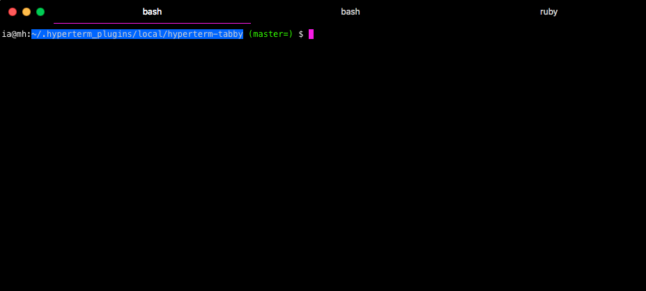

hyperterm-tabby
========================

Forked from [hyperterm-mactabs](https://github.com/insanityfarm/hyperterm-mactabs), this is a far ~~dumber~~ simpler version. It underlines your current tab with a pink line. 

How to use
----------

Add `hyperterm-tabby` to `plugins` in `~/.hyperterm.js`. HyperTerm should automatically load the plugin. If it does not, perform a "Full Reload" for the change to take effect.

[Hyperterm]: https://hyperterm.org/
